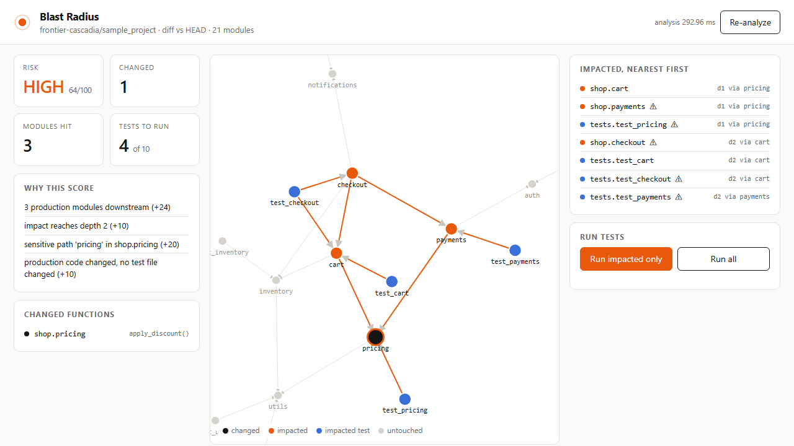

# Blast Radius

Change one line, see exactly what it can break, and run only the tests that matter.

Blast Radius reads your uncommitted diff, maps every changed line to the function it lives in, walks the repo's import graph to find every module and test downstream, scores the risk of the change, and runs just the impacted tests. Standard library for the analysis, one FastAPI process for the console, no external services, works offline.

Built solo in one sitting for Frontier Cascadia 2026 (Automated Software Engineering track).



## Quickstart

```
pip install -r requirements.txt
python -m blastradius --repo sample_project --serve
```

Open http://127.0.0.1:8000. Or on Windows just run `run.bat`.

CLI, no browser:

```
python demo.py break                                   # plant a one-line bug in shop/pricing.py
python -m blastradius --repo sample_project            # analysis only
python -m blastradius --repo sample_project --run      # analysis, then pytest on impacted tests only
python demo.py reset
```

## The demo in 60 seconds

1. Console opens on a clean tree: 21 modules, risk NONE.
2. `python demo.py break` changes one line inside `apply_discount()` in `shop/pricing.py`.
3. Re-analyze. The graph lights up: pricing (changed) reaches cart and payments at depth 1, checkout at depth 2. Four of ten test files are selected. Risk goes to HIGH 64/100 with the reasons listed: three production modules downstream, depth 2, the change sits on a pricing path, and no test file changed.
4. Run impacted only. Pytest runs 4 files in under three seconds (interpreter startup included) and three of them fail. The bug is caught before the PR exists.
5. Run all for comparison: 10 files, same failures, more time. Search, auth, reports and inventory tests never needed to run.

## What is real

| Piece | Status |
|---|---|
| Import graph from `ast`, absolute and relative imports, package resolution | real, `blastradius/graph.py` |
| Diff to function mapping from `git diff -U0` hunks | real, `blastradius/diff.py` |
| Transitive impact BFS, depth and "via" path per module | real, `blastradius/engine.py` |
| Risk score with named reasons | real, heuristic weights in `SENSITIVE` |
| Impacted-test selection and pytest runner | real, `server.py` and CLI `--run` |
| Web console with live force graph | real, `blastradius/ui.html` (D3 from CDN is the only network fetch) |
| Own test suite | 6 tests, `python -m pytest tests` |

Measured on the sample repo (21 modules): analysis 130 to 300 ms, impacted run 4 of 10 test files in about 2.7 s including pytest startup.

## Honest limits and roadmap

- Python only. The graph builder is one file; a JavaScript or Go walker plugs into the same engine.
- Function-level change detection is used for display and risk today; impact propagation is module-level. Call-graph-level propagation is the next step and shrinks the selected test set further.
- Dynamic imports and monkeypatching are invisible to static analysis.
- Risk weights are hand-set heuristics, not learned. A GitHub Action that comments the blast radius on every PR is the obvious productization.

## Layout

```
blastradius/   engine, graph, diff, CLI, FastAPI server, console UI
sample_project/  synthetic shop backend (9 modules, 10 test files) used for the demo
tests/         Blast Radius's own tests
demo.py        plants and reverts the demo bug
media/         screenshots and demo video assets
```

## Disclosures

AI tools: Claude Code (Claude Fable 5.1) was used as a pair programmer for the whole build. Design decisions (the wedge, the risk model, the demo arc) are mine. No paid services, credits, or sponsored resources. No LLM runs inside the product.
